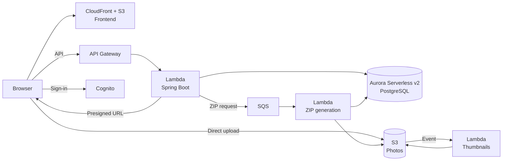

# Pictures POV App

Web application that collects, in a shared gallery, the photos guests take during an event, through a QR code and without needing to create an account.

## Description

### Problem

At weddings, birthdays and parties, attendees take a large number of photos with their phones that rarely reach the organizers. The usual alternatives, such as messaging groups or shared folders, require each guest to install an app, create an account or receive a link individually; they reduce image quality and scatter the photos across several channels.

### How it works

1. An administrator creates the event and assigns it to the email of the customer organizing it.
2. The organizer gets the event's link and QR code and places them at the venue.
3. Guests scan the code, open the event page without creating an account and upload photos from their phone's gallery or by taking them with the camera, up to a per-device limit (10 by default).
4. All photos are shown in a shared event gallery.
5. The organizer signs in to view, moderate and download the photos in a ZIP file.

### Roles

| Role | Description | Main capabilities |
|---|---|---|
| Guest | Event attendee. Has no account. | Access the event through the QR code or link, upload photos within their limit, view the gallery. |
| Organizer | Customer to whom one or more events are assigned. | View their events, get the link and QR code, customize the event, moderate and download the photos. |
| Administrator | Member of the platform team. | Create, assign and manage events and users across the whole platform. |

### Principles

- **Frictionless for guests.** No account, installation or personal data is required to participate.
- **Control for the organizer.** The organizer decides which photos are shown and who can see the gallery.
- **Per-device limit, not per network.** Attendees of an event usually share the same WiFi network, so the upload limit applies per device and not per IP address.
- **Privacy by default.** Photos are kept for a limited period and download links are temporary.

## Scope

### Included

- Guest access without registration through a QR code or link.
- Photo uploads from the browser with a per-device limit and a total limit per event.
- Event gallery with configurable visibility: public, PIN-protected or visible only to the organizer.
- Sign-in for organizers and administrators with Google or with email and password.
- Photo moderation: hide, show again and delete.
- Download of individual photos and of the whole event in a ZIP file.
- Administration panel for managing events and users.
- Thumbnail generation and automatic photo deletion after a retention period.

### Excluded from the first version

- Video uploads.
- Payments and subscription plans.
- Self-service organizer registration.
- Comments, reactions and photo editing.
- Facial recognition.
- Native mobile app.

Details are specified in the [functional requirements](docs/requerimientos/01_requisitos_funcionales.md).

## Architecture

The application is deployed on AWS using managed services.



| Component | Technology |
|---|---|
| Frontend | Single-page application with React, Vite, TypeScript, React Router, TanStack Query and Tailwind, managed with npm and served from Amazon S3 and Amazon CloudFront. API client types are generated with openapi-typescript. See [ADR 0002](docs/adr/0002-npm-sin-workspaces.md) and [ADR 0003](docs/adr/0003-frontend-react.md). |
| Backend | API with Spring Boot 3 and Java 21, built with Gradle and running on AWS Lambda with SnapStart behind Amazon API Gateway (HTTP API). OpenAPI contract generated with springdoc-openapi. See [ADR 0001](docs/adr/0001-backend-spring-boot-en-lambda.md) and [ADR 0005](docs/adr/0005-compute-aws-lambda.md). |
| Database | Amazon Aurora Serverless v2 (PostgreSQL), scaling to 0 ACU when idle. See [ADR 0004](docs/adr/0004-database-aurora-serverless-v2.md). |
| Authentication | Amazon Cognito with managed sign-in (email/password, with Google planned) and an administrators group. Guests do not authenticate. See [ADR 0006](docs/adr/0006-authentication-amazon-cognito.md). |
| Photo storage | Amazon S3. The browser uploads photos directly using presigned URLs, without the backend receiving the files. |
| Image processing | Lambda function triggered by S3 that generates WebP thumbnails. |
| ZIP generation | Lambda function triggered through Amazon SQS that generates the event's ZIP in the background and stores it in Amazon S3. See [ADR 0008](docs/adr/0008-background-zip-generation.md). |
| Infrastructure | Terraform with reusable modules, development and production environments in separate AWS accounts and remote state in HCP Terraform. See [ADR 0007](docs/adr/0007-infrastructure-as-code-terraform.md). |
| CI/CD | GitHub Actions with OIDC authentication to AWS and independent deployment per component. |

Architecture decisions and their rationale are recorded in [docs/adr](docs/adr/README.md).

## Repository structure

```
.
├── apps/
│   ├── web/          # Frontend (React, npm)
│   │   └── src/api/  # Client types generated from the OpenAPI contract
│   └── api/          # Backend (Spring Boot, Gradle)
├── infra/            # Infrastructure as code (Terraform)
└── docs/             # Project documentation
```

## Getting started

Pending. Will be documented once phase 1 (foundations) is complete.

## Documentation

| Document | Status |
|---|---|
| [Functional requirements](docs/01_requisitos_funcionales.md) | Ready |
| [Non-functional requirements](docs/02_requisitos_no_funcionales.md) | Ready |
| [Architecture Decision Records (ADR)](docs/adr/README.md) | In progress |
