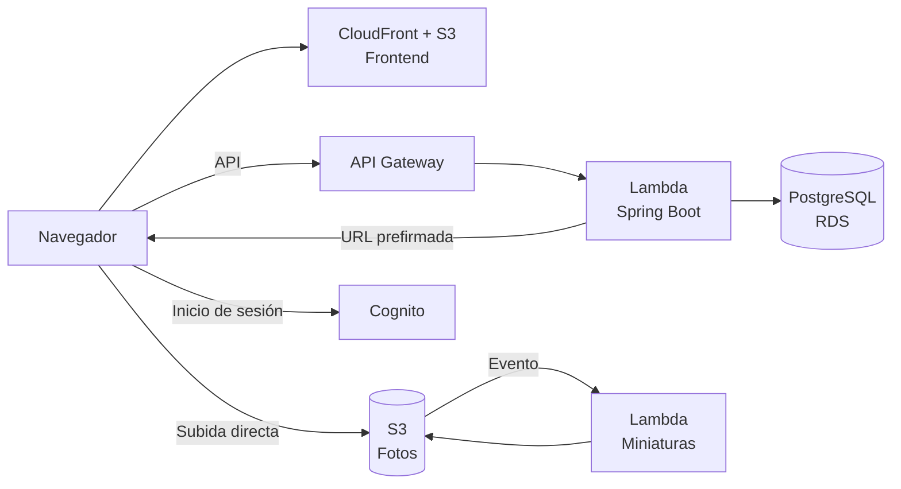

# Pictures POV App

Aplicación web para recopilar en una galería común las fotos que los invitados toman durante un evento, mediante un código QR y sin necesidad de crear una cuenta.

## Descripción

### Problema

En bodas, cumpleaños y fiestas, los asistentes toman una gran cantidad de fotos con sus teléfonos que rara vez llegan a los organizadores. Las alternativas habituales, como grupos de mensajería o carpetas compartidas, exigen que cada invitado instale una aplicación, cree una cuenta o reciba un enlace de forma individual, reducen la calidad de las imágenes y dispersan las fotos en varios canales.

### Cómo funciona

1. Un administrador crea el evento y lo asigna al correo del cliente que lo organiza.
2. El organizador obtiene el enlace y el código QR del evento y los coloca en el lugar de la celebración.
3. Los invitados escanean el código, acceden a la página del evento sin crear una cuenta y suben fotos desde la galería de su teléfono o tomándolas con la cámara, hasta un límite por dispositivo (10 por defecto).
4. Todas las fotos se muestran en una galería común del evento.
5. El organizador inicia sesión para consultar las fotos, moderarlas y descargarlas en un archivo ZIP.

### Roles

| Rol | Descripción | Capacidades principales |
|---|---|---|
| Invitado | Asistente al evento. No dispone de cuenta. | Acceder al evento mediante el QR o el enlace, subir fotos dentro de su límite, consultar la galería. |
| Organizador | Cliente al que se asignan uno o más eventos. | Consultar sus eventos, obtener el enlace y el QR, personalizar el evento, moderar y descargar las fotos. |
| Administrador | Miembro del equipo de la plataforma. | Crear, asignar y gestionar eventos y usuarios de toda la plataforma. |

### Principios

- **Sin fricción para el invitado.** No se exige cuenta, instalación ni datos personales para participar.
- **Control para el organizador.** El organizador decide qué fotos se muestran y quién puede ver la galería.
- **Límite por dispositivo, no por red.** Los asistentes a un evento comparten habitualmente la misma red WiFi, por lo que el límite de subida se aplica por dispositivo y no por dirección IP.
- **Privacidad por defecto.** Las fotos se conservan durante un plazo limitado y los enlaces de descarga son temporales.

## Alcance

### Incluido

- Acceso de invitados sin registro mediante código QR o enlace.
- Subida de fotos desde el navegador con un límite por dispositivo y un límite total por evento.
- Galería del evento con visibilidad configurable: pública, protegida con PIN o visible solo para el organizador.
- Inicio de sesión de organizadores y administradores con Google o con correo y contraseña.
- Moderación de fotos: ocultar, volver a mostrar y eliminar.
- Descarga de fotos individuales y del evento completo en un archivo ZIP.
- Panel de administración para la gestión de eventos y usuarios.
- Generación de miniaturas y eliminación automática de fotos tras un plazo de retención.

### Excluido de la primera versión

- Subida de videos.
- Pagos y planes de suscripción.
- Registro autónomo de organizadores.
- Comentarios, reacciones y edición de fotos.
- Reconocimiento facial.
- Aplicación móvil nativa.

El detalle se especifica en los [requerimientos funcionales](docs/requerimientos/requerimientos-funcionales.md) y las [reglas de negocio](docs/requerimientos/reglas-de-negocio.md).

## Arquitectura

La aplicación se despliega en AWS sobre servicios administrados.



| Componente | Tecnología |
|---|---|
| Frontend | Aplicación de página única con React, Vite, TypeScript, React Router, TanStack Query y Tailwind, gestionada con npm y servida desde Amazon S3 y Amazon CloudFront. Los tipos del cliente de la API se generan con openapi-typescript. Ver [ADR 0002](docs/adr/0002-npm-sin-workspaces.md). |
| Backend | API con Spring Boot 3 y Java 21, construida con Gradle y ejecutada en AWS Lambda con SnapStart detrás de Amazon API Gateway (HTTP API). Contrato OpenAPI generado con springdoc-openapi. Ver [ADR 0001](docs/adr/0001-backend-spring-boot-en-lambda.md). |
| Base de datos | PostgreSQL en Amazon RDS. |
| Autenticación | Amazon Cognito con inicio de sesión administrado (Google y correo/contraseña) y grupo de administradores. Los invitados no se autentican. |
| Almacenamiento de fotos | Amazon S3. El navegador sube las fotos directamente mediante URLs prefirmadas, sin que el backend reciba los archivos. |
| Procesamiento de imágenes | Función Lambda disparada por S3 que genera miniaturas en formato WebP. |
| Infraestructura | Terraform con módulos reutilizables, entornos de desarrollo y producción en cuentas de AWS separadas y estado remoto en S3. |
| CI/CD | GitHub Actions con autenticación OIDC hacia AWS y despliegue independiente por componente. |

Las decisiones de arquitectura y su justificación se registran en [docs/adr](docs/adr/README.md).

## Estructura del repositorio

```
.
├── apps/
│   ├── web/          # Frontend (React, npm)
│   │   └── src/api/  # Tipos del cliente generados desde el contrato OpenAPI
│   └── api/          # Backend (Spring Boot, Gradle)
├── infra/            # Infraestructura como código (Terraform)
└── docs/             # Documentación del proyecto
```

## Cómo empezar

Pendiente. Se documentará al completar la fase 1 (cimientos).

## Documentación

| Documento | Estado |
|---|---|
| [Requerimientos funcionales](docs/01_requisitos_funcionales.md) | Listo |
| [Requerimientos no funcionales](docs/02_requisitos_no_funcionales.md) | Listo |
| [Registros de decisiones de arquitectura (ADR)](docs/adr/README.md) | En curso |

