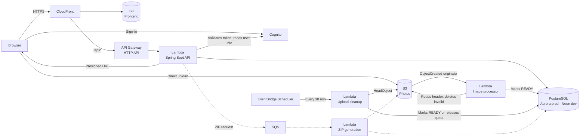

# Pictures POV App

Guests scan a QR code at an event and upload their photos, with no account needed; the organizer collects them all in one gallery.

## How it works

1. An administrator creates the event and assigns it to an organizer.
2. The organizer places the event's QR code at the venue.
3. Guests scan it and upload photos from their phone (10 per device by default).
4. Each guest sees and can delete only the photos they uploaded, while the event is active.
5. The organizer moderates the photos and downloads them as a ZIP.

## Roles

| Role | Who | Can |
|---|---|---|
| Guest | Event attendee, no account | Upload photos and delete their own |
| Organizer | Customer with assigned events | Customize the event, moderate and download photos |
| Administrator | Platform team | Manage all events and users |

## Scope

**Included:** QR access without registration · uploads with per-device and per-event limits · event gallery for the organizer and moderators · sign-in with Google or email · moderation · single and ZIP downloads · admin panel · thumbnails · automatic deletion after a retention period.

**Not in the first version:** videos · payments · self-service sign-up · comments and reactions · gallery for guests · photo editing · facial recognition · native app.

Details: [functional requirements](docs/01_requisitos_funcionales.md).

## Architecture

Serverless on AWS: each environment with no traffic costs ≤ 25 USD/month.


```mermaid
flowchart LR
    U[Browser] -->|HTTPS| CF[CloudFront]
    CF --> WEB[(S3<br/>Frontend)]
    CF -->|/api/*| APIGW[API Gateway<br/>HTTP API]
    APIGW --> L[Lambda<br/>Spring Boot API]
    L --> DB[(PostgreSQL<br/>Aurora prod · Neon dev)]
    L -->|Presigned URL| U
    U -->|Direct upload| S3[(S3<br/>Photos)]
    U -->|Sign-in| COG[Cognito]
    L -->|Validates token, reads user info| COG
    S3 -->|ObjectCreated originals/| IP[Lambda<br/>Image processor]
    IP -->|Reads header, deletes invalid| S3
    IP -->|Marks READY| DB
    SCH[EventBridge Scheduler] -->|Every 30 min| UC[Lambda<br/>Upload cleanup]
    UC -->|HeadObject| S3
    UC -->|Marks READY or releases quota| DB
    L -.->|ZIP request| Q[SQS]
    Q -.-> Z[Lambda<br/>ZIP generation]
    Z -.-> S3
    Z -.-> DB
```

| Part | Technology | ADR |
|---|---|---|
| Frontend | React + Vite + TypeScript, npm, on S3 + CloudFront; CloudFront also routes `/api/*` to the API | [0002](docs/adr/0002-npm-without-workspaces.md), [0003](docs/adr/0003-frontend-react.md), [0017](docs/adr/0017-api-same-origin-cloudfront.md) |
| Backend | Spring Boot 4.1.1 + Java 21, Maven, on Lambda as a zip with SnapStart and Lambda Web Adapter | [0001](docs/adr/0001-backend-spring-boot-en-lambda.md), [0013](docs/adr/0013-lambda-zip-snapstart-web-adapter.md), [0005](docs/adr/0005-compute-aws-lambda.md), [0009](docs/adr/0009-backend-build-tool-maven.md) |
| Database | Aurora Serverless v2 (PostgreSQL), Liquibase in CI/CD | [0004](docs/adr/0004-database-aurora-serverless-v2.md), [0010](docs/adr/0010-database-migrations-liquibase.md) |
| Sign-in | Amazon Cognito | [0006](docs/adr/0006-authentication-amazon-cognito.md) |
| Photos | S3 with direct uploads (presigned URLs) and WebP thumbnails | — |
| ZIP | Background Lambda via SQS | [0008](docs/adr/0008-background-zip-generation.md) |
| Infrastructure | Terraform, one AWS account, state in S3 | [0007](docs/adr/0007-infrastructure-as-code-terraform.md), [0011](docs/adr/0011-terraform-state-amazon-s3.md), [0012](docs/adr/0012-single-aws-account.md) |
| CI/CD | GitHub Actions with OIDC | — |

## Repository

```
apps/
  web/              Frontend (React)
  api/              Backend (Spring Boot)
  image-processor/  Lambda that validates uploaded photos (Node.js)
  upload-cleanup/   Scheduled Lambda that frees stale uploads (Node.js)
db/                 Liquibase migrations
infra/
  bootstrap/        Bucket for the Terraform state
  modules/          Reusable Terraform modules
  environments/     dev and prod
scripts/            Helper scripts
docs/               Requirements and ADRs
```

## Getting started

Pending: documented after phase 1.

### First administrator

After the first `terraform apply` of an environment, create its first admin:

```bash
./scripts/create-first-admin.sh <user-pool-id> <email>
```

## Documentation

- [Functional requirements](docs/01_requisitos_funcionales.md)
- [Non-functional requirements](docs/02_requisitos_no_funcionales.md)
- [Architecture decisions (ADR)](docs/adr/README.md)
