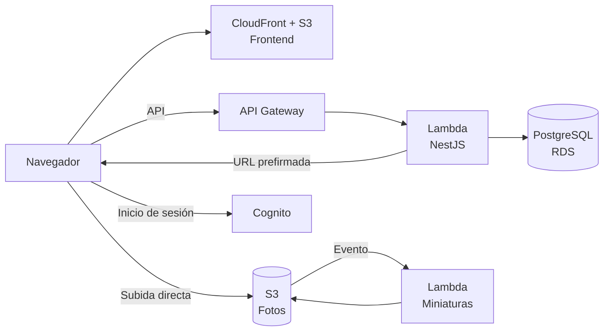

## 7. Arquitectura de alto nivel

La aplicación se despliega en AWS sobre servicios administrados y sin servidores:

| Componente | Tecnología |
|---|---|
| Frontend | Aplicación de página única con React, Vite y TypeScript, servida desde Amazon S3 y Amazon CloudFront. |
| Backend | API con NestJS ejecutada en AWS Lambda detrás de Amazon API Gateway (HTTP API). |
| Base de datos | PostgreSQL en Amazon RDS. |
| Autenticación | Amazon Cognito con inicio de sesión administrado (Google y correo/contraseña) y grupo de administradores. Los invitados no se autentican. |
| Almacenamiento de fotos | Amazon S3. El navegador sube las fotos directamente mediante URLs prefirmadas, sin que el backend reciba los archivos. |
| Procesamiento de imágenes | Función Lambda disparada por S3 que genera miniaturas en formato WebP. |

